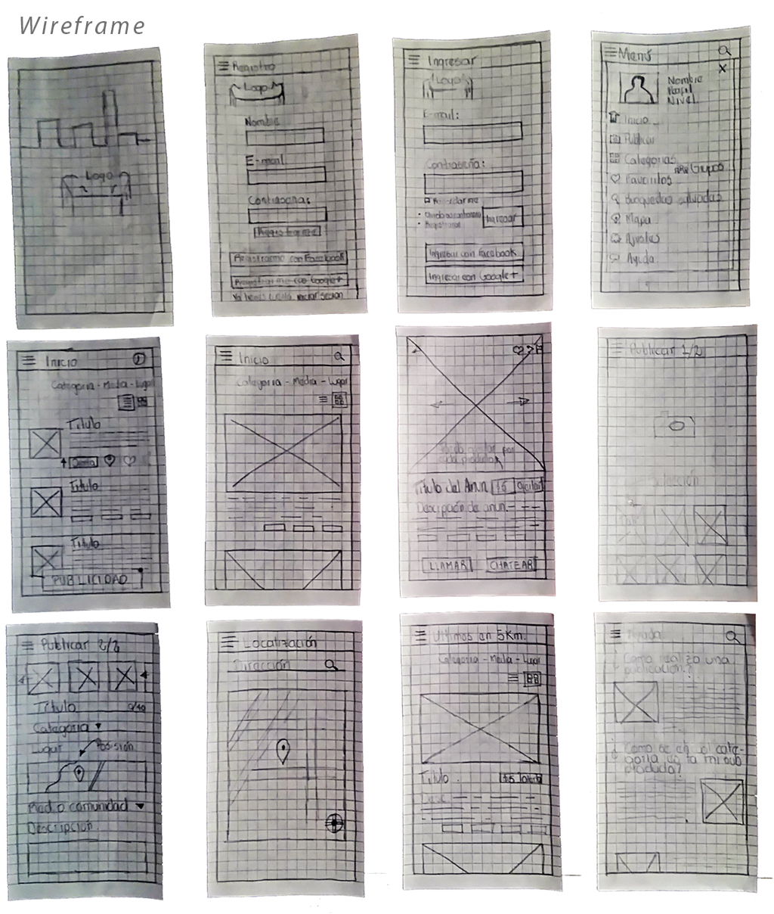

# UNIANDINOS-GRUPO_5_RECICLAR_P_RESPIRAR

Es el proyecto de para la localidad de Engativa Reciclar para respirar

## Proyecto Reuse App

### Objetivo general: 
Sistema de Oferta y Demanda de Subproductos

#### Objetivos especificos:

Evitar que las personas dispongan inadecuadamente los subproductos o desechos que pueden llegar a ser reutilizables o reciclables. Fomentar una cultura de aprovechamiento de los subproductos por cada una de sus categorias.

#### Subproductos 

Definicion. Una sustancia u objeto, resultante de un proceso de producción, cuya finalidad primaria no sea la producción de esa sustancia u objeto, puede ser considerada como subproducto y no como residuo, únicamente si se cumplen las siguientes condiciones:

- a) es seguro que la sustancia u objeto va a ser utilizado ulteriormente; 
- b) la sustancia u objeto puede utilizarse directamente sin tener que someterse a una transformación ulterior distinta de la práctica industrial normal; 
- c) la sustancia u objeto se produce como parte integrante de un proceso de producción; y 
- d) el uso ulterior es legal, es decir la sustancia u objeto cumple todos los requisitos pertinentes para la aplicación específica relativos a los productos y a la protección del medio ambiente y de la salud, y no producirá impactos generales adversos para el medio ambiente o la salud humana.

##### Clasificación de los Subproductos. 

- 1 Subproductos químicos 
- 2 Productos Plásticos 
- 3 Metales 
- 4 Papel y cartón 
- 5 Maderas 
- 6 Textiles 
- 7 Goma y caucho 
- 8 Vidrio 
- 9 Cuero y pieles 
- 10 Escombros y minería 
- 11 Residuos animales y vegetales 
- 12 Productos petrolíferos y aceites 
- 13 Chatarra y escoria de siderurgia 
- 14 Varios 
- 15 Embalajes

### Sketch

